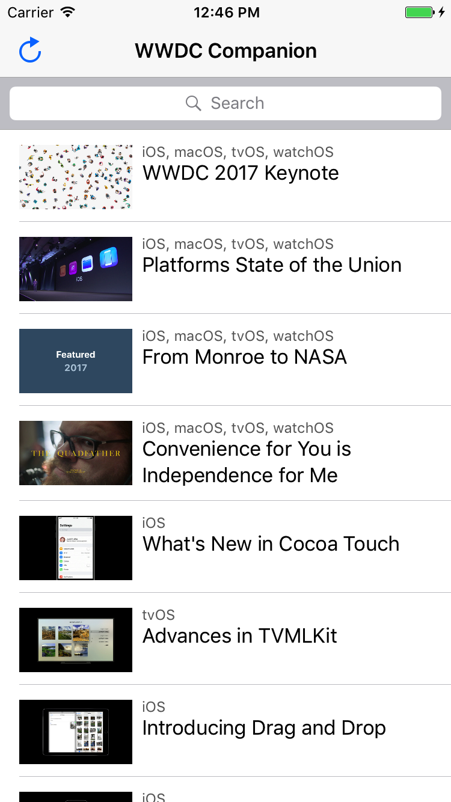
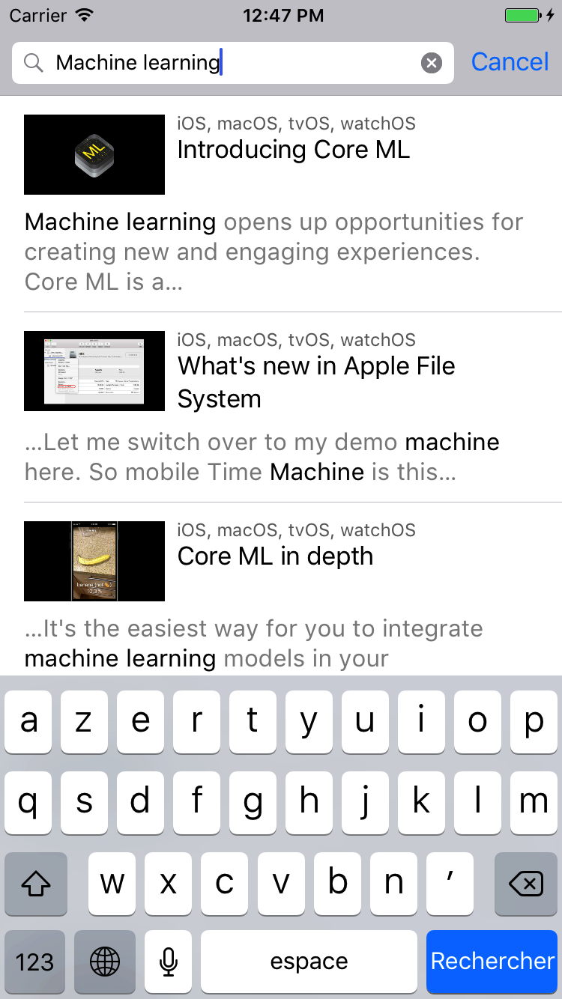
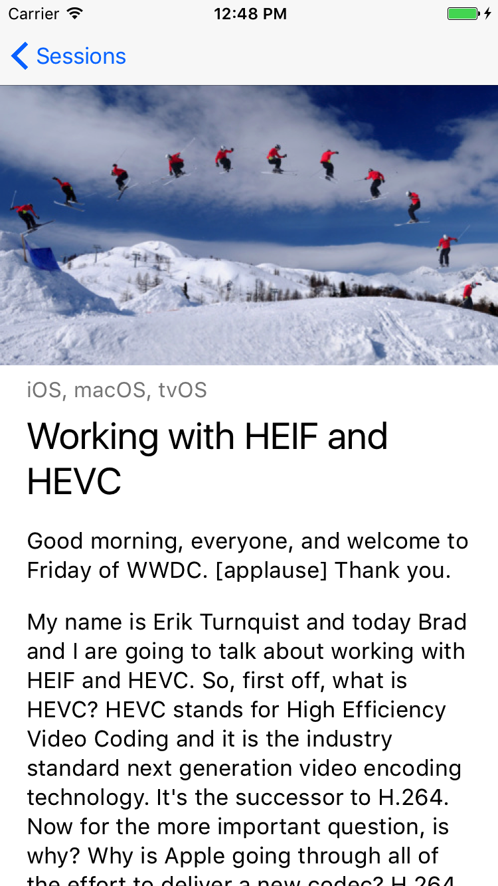

WWDC Companion
==============

|         |         |         |         |
| :-----: | :-----: | :-----: | :-----: |
|  |  |  |  |

**This Swift 3 application stores, displays, and lets the user search the [WWDC 2016 sessions](https://developer.apple.com/videos/wwdc2016/).**

It shows how to:

- **Perform full-text search** in an SQLite database with [GRDB.swift](http://github.com/groue/GRDB.swift)
- **Render HTML templates** with [GRMustache.swift](https://github.com/groue/GRMustache.swift)
- **Parse HTML** with [Fuzi](https://github.com/cezheng/Fuzi)
